<!--ts-->
   * [AndroidSec](#androidsec)
      * [1. Dalvik下DexClassLoader动态加载关键函数链(基于Android4.4)](#1-dalvik下dexclassloader动态加载关键函数链基于android44)
      * [2. Art下DexClassLoader动态加载关键函数链(基于Android8.0)](#2-art下dexclassloader动态加载关键函数链基于android80)
      * [3. Art下InMemoryDexClassLoader动态加载关键函数链(基于Android8.0)](#3-art下inmemorydexclassloader动态加载关键函数链基于android80)
      * [4. Dalvik下RegisterNatives动态注册关键函数链(基于Android4.4)](#4-dalvik下registernatives动态注册关键函数链基于android44)
      * [4. Art下RegisterNatives动态注册关键函数链(基于Android8.1)](#4-art下registernatives动态注册关键函数链基于android81)
      * [2020-07-08 新增<a href="dex2apk.py">dex2apk.py</a>](#2020-07-08-新增dex2apkpy)
      * [2020-09-19 将自己之前改的的DumpApkInfo工具引入](#2020-09-19-将自己之前改的的dumpapkinfo工具引入)
      * [2020-10-09 增加<a href="unicorn_so.py">unicorn trace arm64的基本代码</a>](#2020-10-09-增加unicorn-trace-arm64的基本代码)
      * [2020-10-10 增加一个<a href="okio.dex">byte数组转hexString的dex</a>](#2020-10-10-增加一个byte数组转hexstring的dex)
      * [2020-10-31 增加<a href="hook_init_array.js">hook_init_array代码</a>](#2020-10-31-增加hook_init_array代码)
      * [2020-11-02 增加<a href="hook_constructors.js">hook_constructors代码</a>](#2020-11-02-增加hook_constructors代码)
      * [2021-03-31 增加<a href="hook_getContext.js">主动获取context方法</a>](#2021-03-31-增加主动获取context方法)
      * [2021-04-06 增加<a href="hook_RegisterNative.js">hook RegisterNative函数的脚本</a>](#2021-04-06-增加hook-registernative函数的脚本)
      * [2021-04-14 增加<a href="hook_Iterator.js">在native层遍历HashMap代码</a>](#2021-04-14-增加在native层遍历hashmap代码)
      * [2021-04-17 get到一个新姿势：更改进程名](#2021-04-17-get到一个新姿势更改进程名)
      * [2021-04-24 又找到一个anti-frida的方式](#2021-04-24-又找到一个anti-frida的方式)
      * [2021-05-23 frida hook enum class 的方式](#2021-05-23-frida-hook-enum-class-的方式)
      * [2021-06-03 frida 无法hook上函数总结](#2021-06-03-frida-无法hook上函数总结)
      * [2021-07-28 将注册的类加入双亲委派链](#2021-07-28-将注册的类加入双亲委派链)

<!-- Added by: simp1er, at: 2021年 6月 3日 星期四 16时02分10秒 CST -->

<!--te-->

# AndroidSec

## 1. Dalvik下DexClassLoader动态加载关键函数链(基于Android4.4)
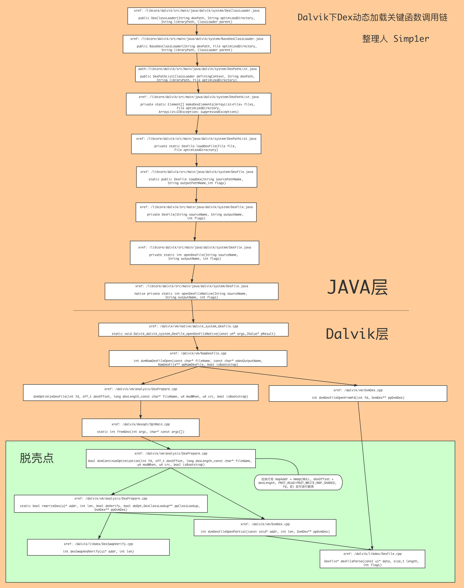
## 2. Art下DexClassLoader动态加载关键函数链(基于Android8.0)
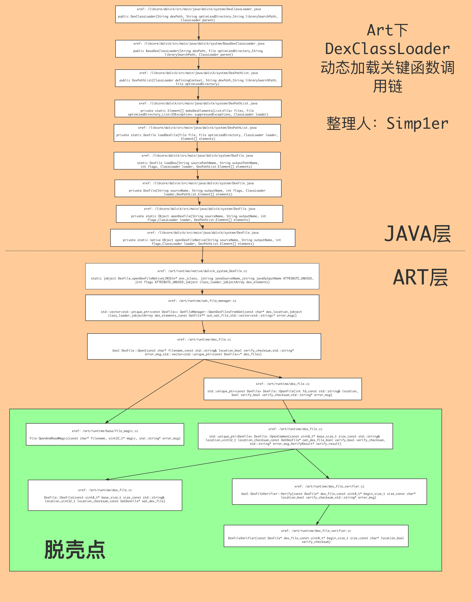
## 3. Art下InMemoryDexClassLoader动态加载关键函数链(基于Android8.0)
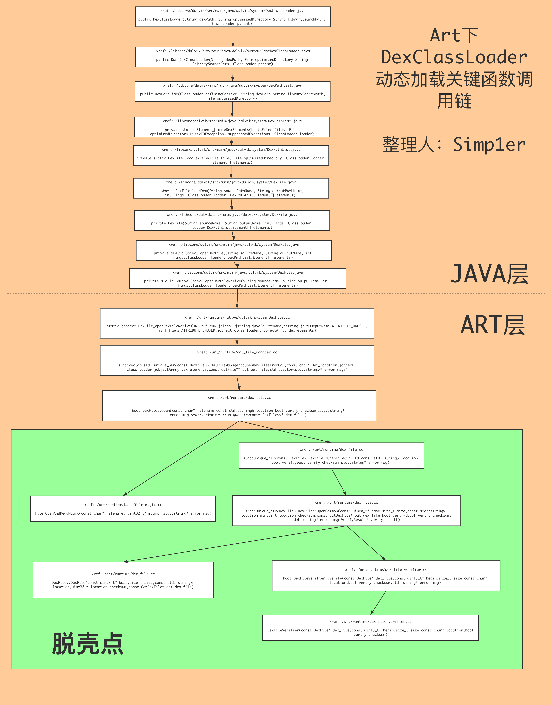
## 4. Dalvik下RegisterNatives动态注册关键函数链(基于Android4.4)
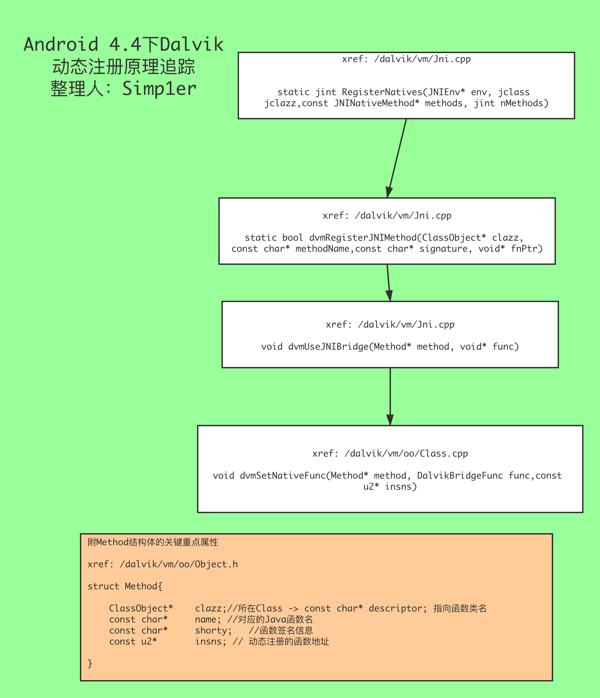
## 4. Art下RegisterNatives动态注册关键函数链(基于Android8.1)
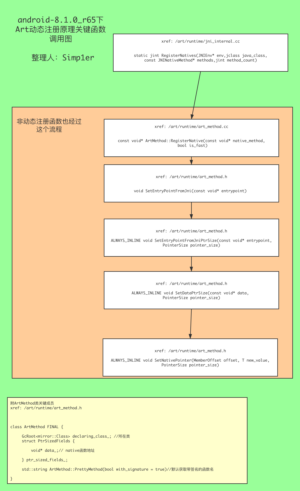


## 2020-07-08 新增[dex2apk.py](dex2apk.py)
一个用于将脱壳下来的众多dex重新组装成apk的脚本，免去Android安全测试人员在逆向过程中不停`grep`的操作  

- usage: python dex2apk.py [-h] -a APK_PATH -i DEX_PATH [-o OUTPUT]   
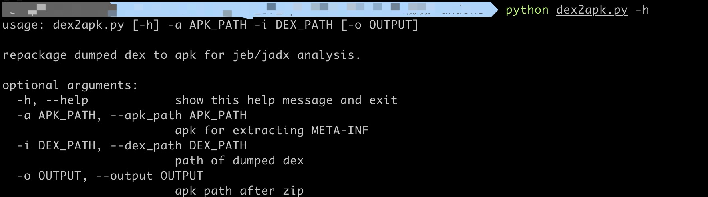

  

将重新组合的`apk`拖入`jadx`和`jeb`,展示结果如下：  

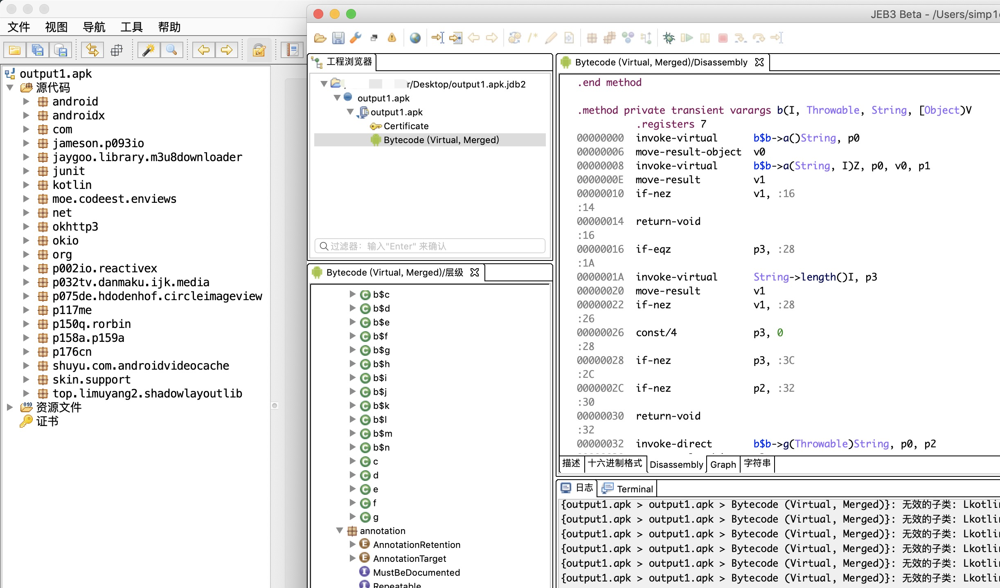


## 2020-09-19 将自己之前改的的DumpApkInfo工具引入

DumpApkInfo可以用来dump加壳信息、签名信息、APK包名等等功能，具体参见子模块[readme](https://github.com/Simp1er/DumpApkInfo/blob/master/README.md)


## 2020-10-09 增加[unicorn trace arm64的基本代码](unicorn_so.py)

大概效果如下

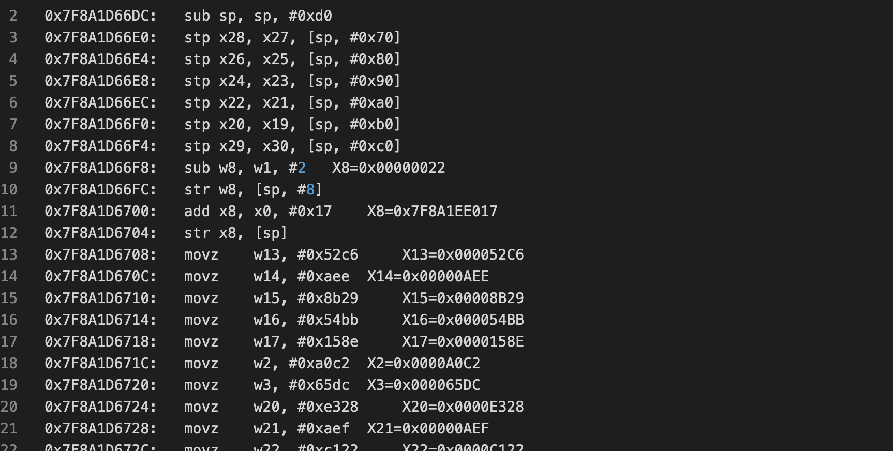

基于unicorn和capstone来trace函数执行流程并记录寄存器信息，具体自己看代码吧，只是一个demo

## 2020-10-10 增加一个[byte数组转hexString的dex](okio.dex)

手动封装了`okio.ByteString`的函数，并打包成dex，避免frida在hook APP时无法使用`ByteString`的转hex方法，frida使用方式

首先将dex push进`/data/local/tmp/`目录下，然后`chmod`给予`dex`执行权限,frida调用时

```js
 Java.perform(function (){
 			 var okio = Java.openClassFile("/data/local/tmp/okio.dex")
       okio.load()
   			var ByteString  = Java.use("com.Simp1er.okio.ByteString")
         ByteString.$new(key_bytes).hex()// 其实接下来就是ByteString的函数调用了
 })

```

参考： [ByteString.java](https://android.googlesource.com/platform/external/okhttp/+/3c938a3/okio/src/main/java/okio/ByteString.java)

## 2020-10-31 增加[hook_init_array代码](hook_init_array.js)

通过hook`linker`的`call_array`函数，hook得到`init_array`地址，在Android8.1 64位程序和32为程序上都测试成功，其他的请自己测试更改。


## 2020-11-02 增加[hook_constructors代码](hook_constructors.js)

通过hook`linker`的`async_safe_format_log`函数，hook得到`init_array`以及`.init_proc`地址，在Android8.1 64位程序和32为程序上都测试成功，其他的请自己测试更改。
64位效果如下：
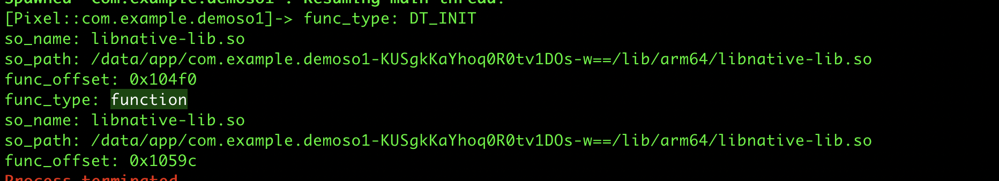
32位效果如下：
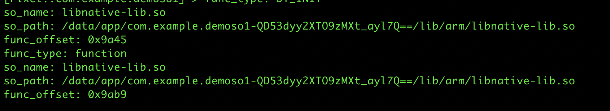


## 2021-03-31 增加[主动获取context方法](hook_getContext.js)

利用`ActivityThread`的单例模式获取到应用的上下文`Context`用于后续利用

效果如下
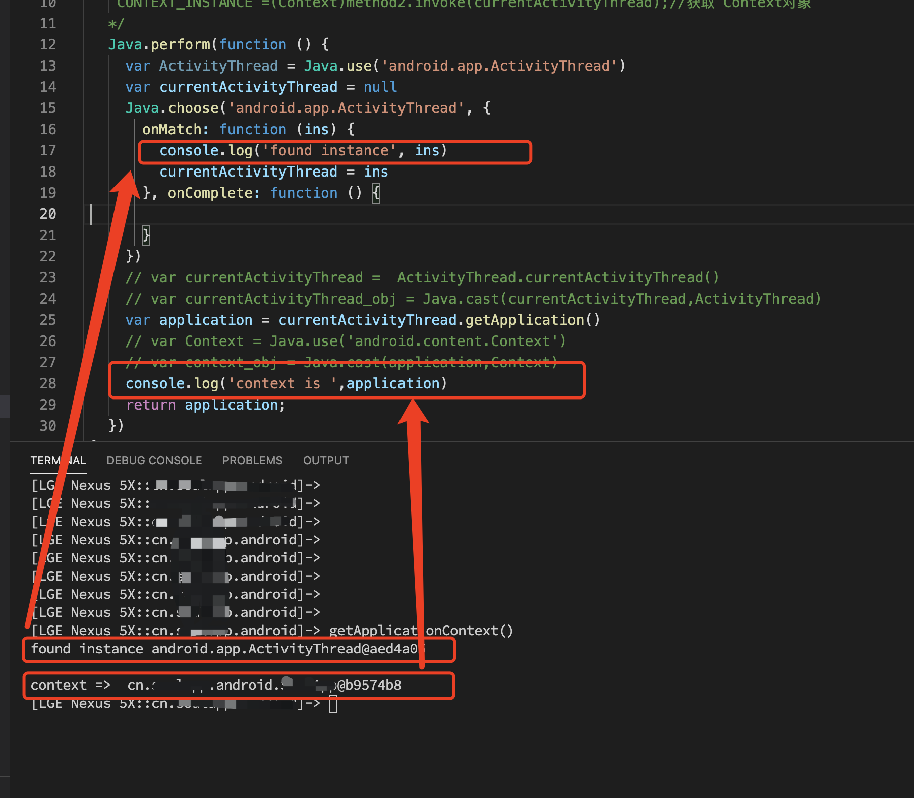

## 2021-04-06 增加[hook RegisterNative函数的脚本](hook_RegisterNative.js)

由于jni函数无论是动态注册或者静态注册的函数都会在加载过程中都会调用`RegisterNative`函数注册`JNI`函数最终函数地址，因此可以通过`hook` `RegisterNative`函数获取`JNI`函数最终地址以及函数实现所在模块，最终效果如下：

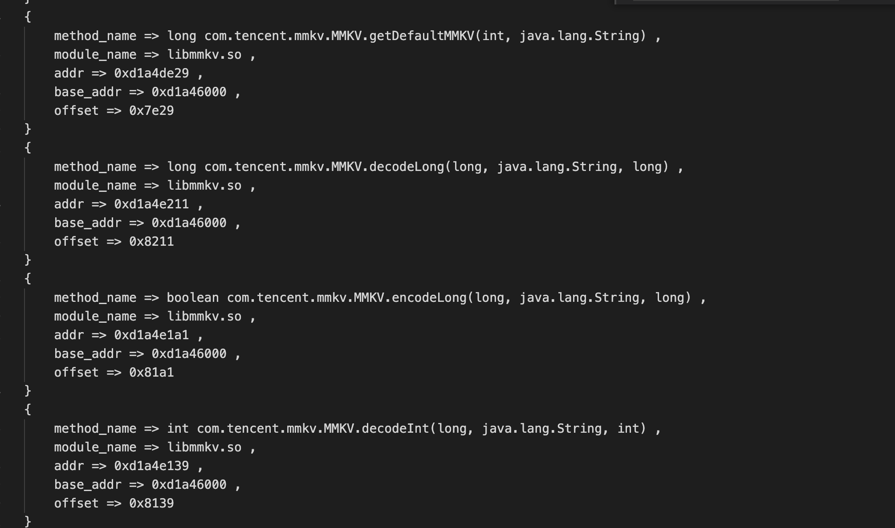

注意：仅在`Android 8.1.0_r1`下测试成功，其他版本可能失效


## 2021-04-14 增加[在native层遍历`HashMap`代码](hook_Iterator.js)

在`native`层遍历`HashMap`中`key`和`value`类型都为`String`的脚本

传入一个`JNIEnv`和`HashMap`的对象即可
最终效果如下
```
xxx => azU7Bc002xAAJ9QEYW1mGJrO8f0Ed9QH0FqzYdOlL8/Md/QHpENnwiLJhCBZB5mhQtIXdU8Pnw43BRB7hD6QY3VDdZfUF9QH1BfUB9
bbbb => HHnB_FCRa80QdwWegx+jn98jVfguVXqGwR3kh9ROtBHavXaYZV+qLX+lUnG4LVQfyqsJ/zFo0JH2gRVVSi98GPkuj9GWADR18oS+VyJ2XhLUQYev/wQDCMFWSAYaGABE2SOBT
cccc => JAE5zHBA7W55NB1VcTLaT8wI/An8Ae8A+wn5Gvsa7wj6CPQN/Qv6CPg=
dddd => hwIABwRLPF9s5QJ40ATaaW1cNymwhLCe
```

## 2021-04-17 get到一个新姿势：更改进程名

`android.os.Process`中的`setArgV0()`函数可用于改变`APP`的进程名。感谢卓桐大佬！！[Android修改进程名](https://bbs.pediy.com/thread-253676.htm)


注意：这里由于`Java.lang.Process`类是默认导入的包，因此在使用时需要单独`import`导入`android.os.Process`类。
```java
import android.os.Process;

try {
    // https://bbs.pediy.com/thread-253676.htm
    Method setArgV0 = Process.class.getDeclaredMethod("setArgV0", String.class);
    setArgV0.setAccessible(true);
    setArgV0.invoke(null,"com.tencent.mm");

} catch (Throwable e) {
    // java.lang.NoSuchMethodException: setArgV0 [class java.lang.String]
    e.printStackTrace();
    Log.i("nicai", "onCreate: ");
} 
```

这里测试`APP`的包名为`com.test.changeprocessname`但是当使用`ps -e`命令查看进程会发现找不到这个进程，最终效果如下

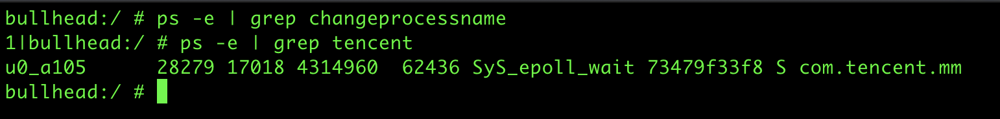

## 2021-04-24 又找到一个anti-frida的方式

frida在注入进程后如果脚本中使用`registerClass`这个`API`，在内存空间中会出现`frida`为前缀的`vdex/odex`，即使`frida`退出后，本次进程的内存空间仍旧还存在这样的痕迹。

展示如下图

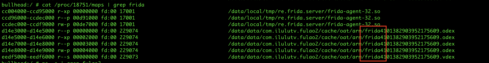


`anti-anti`的方式是在调用`registerClass`这个`API`之前执行以下语句

```js
Java.classFactory.tempFileNaming.prefix = "onetwothree"
..
Java.registerClass(...)
```

自定义后效果

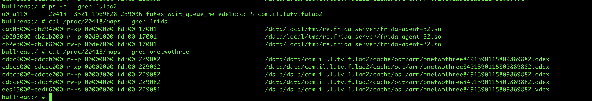

## 2021-05-23 frida hook enum class 的方式

[hookEnum.js](hookEnum.js)

当`hook` `Enum`类时，`this`指针就是`Enum`类中具体成员的值。

比如我这里写了一个枚举类，代码如下
```java
public enum enumClazz {
    OAID("QAID"),TOKEN("TOKEN"), VIP("1");

    private String value;
     enumClazz(String value){
        this.value = value;
    }

    public String getValue(){
        return this.value;
    }
    public void setValue(String value){
        this.value = value;
        Log.e("enum", "className: " + this );
    }
}
```

在调用时使用方法像这样
```java
enumClazz.OAID.setValue("OAID_value");
enumClazz.TOKEN.setValue("TOKEN_value");
enumClazz.VIP.setValue("VIP_value");
```
此时调用`setValue(String)`函数打印出来的日志如下
```bash
2021-05-23 16:24:31.258 26207-26207/com.simp1er.enumdemo E/enum: className: OAID
2021-05-23 16:24:31.262 26207-26207/com.simp1er.enumdemo E/enum: className: TOKEN
2021-05-23 16:24:31.265 26207-26207/com.simp1er.enumdemo E/enum: className: VIP
```

可以发现其实对应的`this`指针就是对应调用的枚举成员。

最终使用`frida`进行`hook`时，主要代码如下

```js
function hook(){
    Java.perform(function(){
        var enumClazz = Java.use('com.simp1er.enumdemo.enumClazz')
    enumClazz.setValue.implementation = function(){
        var value = arguments[0];
        console.log('class =>',this,", value =>",value) // this即代表enum类的对象名称。
      //  console.log('class =>',this.getString())
        return this.setValue(value)
    }
    });
}
```
效果如下
```bash
class => OAID , value => OAID_value
class => TOKEN , value => TOKEN_value
class => VIP , value => VIP_value
```

但是参考中的`this.getString()`方法并没有成功。


参考：[https://bbs.pediy.com/thread-258772.htm#enum%E6%B5%8B%E8%AF%95](https://bbs.pediy.com/thread-258772.htm#enum%E6%B5%8B%E8%AF%95)

## 2021-06-03 frida 无法hook上函数总结


如果函数hook不到，
- 首先，想想这个函数是不是真的执行到了；
- 其次，想想函数所在类是不是接口类、是不是抽象类（检查方法可以通过Objection-WallBreaker搜索是否有对应实例或者直接看官方文档，如果是抽象类要找对应继承类中是否有对应函数的实现、如果是接口类找对应implements）
- 再次，可以试试`Java.deoptimizeEverything()`函数

-- 记一次hook不到有感

[Hooking to Context doesn't work](https://github.com/frida/frida-java-bridge/issues/67)

[Context类](https://developer.android.com/reference/android/content/Context)


## 2021-07-28 将注册的类加入双亲委派链

[hook代码](hook_classLoader.js)

将通过`Java.registerClass() API`注册的类所在的`dexclassLoader`加入系统`classLoader`双亲委派链中，保证能够`Class.forName`函数调用注册的函数时能够成功。


